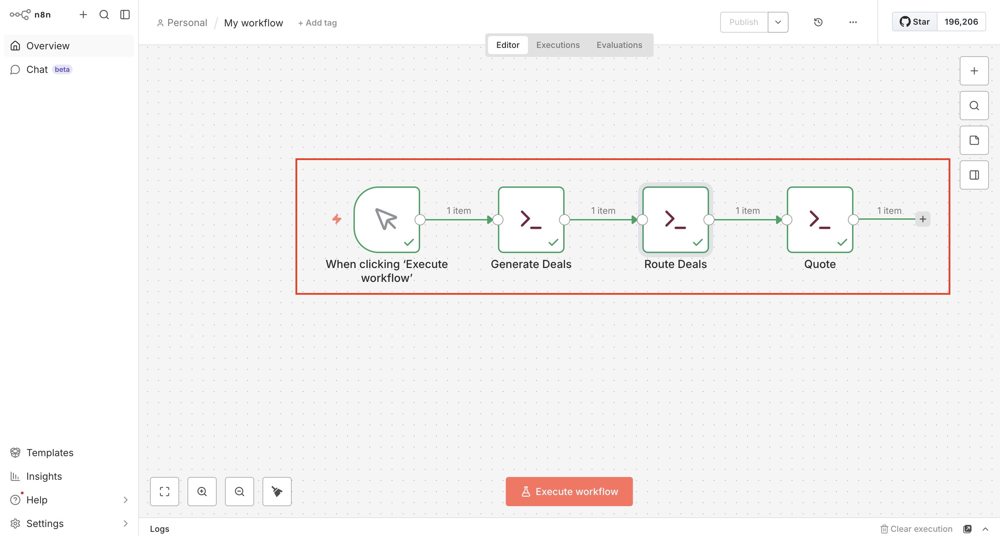
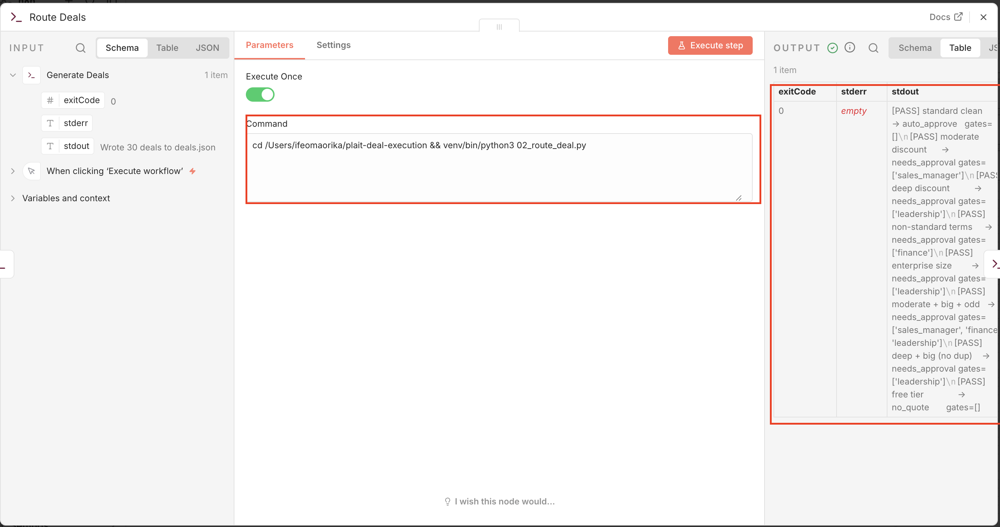

# Plait Deal Execution

Routing + quote generation for Plait deals. Picks up where the scoring
pipeline (What Sales Sees) leaves off: a scored deal enters, gets routed
through the right approval gates, and on approval a quote PDF is generated.

## The flow

deal enters -> routing logic decides which approval gates apply ->
gates cleared -> order-form PDF generated

## Scripts

- `01_generate_deals.py` — synthetic deal generator. Hybrid mix: weighted
  toward realistic proportions (most deals clean) but every batch forces at
  least one deal per routing branch, so all branches are always demonstrable.
  Note: at small batch sizes the forced-coverage floor skews the mix
  exception-heavy; this evens out at larger batches.
- `02_route_deal.py` — the routing logic. Evaluates each deal against the
  deal-desk policy and returns the set of approval gates required. Gates
  accumulate: one deal can require several sign-offs. Run directly to see
  the built-in branch tests.
- `03_generate_quote.py` — renders an approved deal into an order-form PDF
  via `templates/quote.html`. List price is reconstructed from the discounted
  ACV so the discount math reconciles on the document.

## Policy thresholds

Set in `02_route_deal.py` as named constants. Illustrative, but the ratios
are realistic for a self-serve product like Plait:

- Discounts over 15% require a sales manager
- Non-standard terms require finance
- Deals at/above $25k ACV require leadership

## Note on data

All deals are synthetic. This is a portfolio artifact demonstrating routing
and document-generation design, not real commercial data. The generated PDFs
state this in their footer.

## Running it

    pip install -r requirements.txt
    # WeasyPrint needs a few system libs — see weasyprint.org install docs

    python3 02_route_deal.py       # prints PASS/FAIL for each routing branch
    python3 01_generate_deals.py   # writes deals.json
    python3 03_generate_quote.py   # writes a quote PDF into output/

## Orchestration

The three scripts above are wired into a single automated flow using [n8n](https://n8n.io),
a workflow-automation tool running locally. Instead of running each script by hand, a manual
trigger fires the whole chain in order: generate a batch of deals, route each one through the
approval logic, then generate a quote.

The design choice worth naming: the routing logic stays in Python (`02_route_deal.py`), not
in n8n's visual nodes. n8n orchestrates — it triggers the flow and calls the scripts — but the
judgment lives in tested, version-controlled code that can be read in this repo. This mirrors how
real systems separate an orchestration layer from a decision engine, and it keeps the logic in
one place rather than duplicated across a visual tool and a codebase.

Each step is an Execute Command node calling the project's scripts through the virtual
environment's Python.

*The full flow: manual trigger → generate deals → route deals → generate quote, each step
green after a successful run.*

*The routing step in detail: the node calls `02_route_deal.py`, exits cleanly (exitCode 0), and
its output shows every routing branch passing — auto-approve, moderate discount to sales manager,
deep discount to leadership, non-standard terms to finance, and gates accumulating on complex deals.*

### Running the orchestration

The workflow runs on a locally-hosted n8n instance (Node 20 LTS). The scripts themselves run
standalone without n8n — see the Running section above. n8n adds the automated trigger-and-chain
layer on top.
